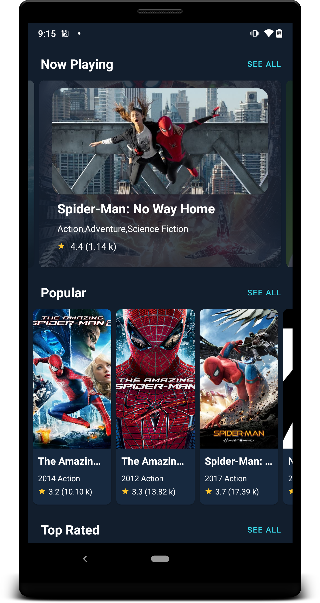
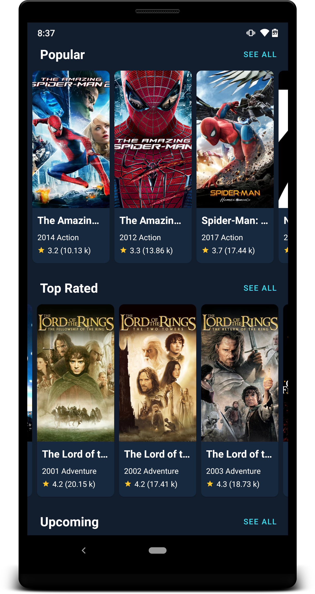

<h1 align="center">MovieHunt</h1>

<p align="center">
MovieHunt is a sample Android project using <a href="https://www.themoviedb.org/">The Movie DB</a> API based on MVVM architecture. It showcases the latest Android tech stacks with well-designed architecture and best practices.



</p>

## Features
* 100% Kotlin
* MVVM architecture
* Reactive pattern
* Android Architecture Components and Jetpack Compose.
* Kotlin Coroutines


## Tech Stacks
* [Retrofit](http://square.github.io/retrofit/) + [OkHttp](http://square.github.io/okhttp/) - RESTful API and networking client.
* [Android Architecture Components](https://developer.android.com/topic/libraries/architecture) - A collections of libraries that help you design rebust, testable and maintainable apps.
    * [Room](https://developer.android.com/training/data-storage/room) - Local persistence database.
    * [ViewModel](https://developer.android.com/reference/androidx/lifecycle/ViewModel) - UI related data holder, lifecycle aware.
    * [LiveData](https://developer.android.com/topic/libraries/architecture/livedata) - Observable data holder that notify views when underlying data changes.
    * [Data Binding](https://developer.android.com/topic/libraries/data-binding) - Declarative way to bind data to UI layout.
    * [Navigation component](https://developer.android.com/guide/navigation) - Fragment routing handler. 
* [Jetpack Compose](https://developer.android.com/jetpack/compose) - Declarative and simplified way for UI development.
* [Coroutine](https://developer.android.com/kotlin/coroutines) Concurrency design pattern for asynchronous programming.
* [Glide](https://github.com/coil-kt/coil) - Image loading.
* [GSON]([https://github.com/JakeWharton/timber](https://github.com/google/gson/blob/main/UserGuide.md)) - JSON Parsing

## Architectures


We follow Google recommended [Guide to app architecture](https://developer.android.com/jetpack/guide) to structure our architecture based on MVVM, reactive UI using LiveData / RxJava observables and data binding.

* **View**: Activity/Fragment with UI-specific logics only.
* **ViewModel**: It keeps the logic away from View layer, provides data streams for UI and handle user interactions.
* **Model**: Repository pattern, data layers that provide interface to manipulate data from both the local and remote data sources. The local data sources will serve as [single source of truth](https://en.wikipedia.org/wiki/Single_source_of_truth).

# Razorpay-payment-gateway-in-Kotlin-
How to integrate razorpay payment gateway in Kotlin android App? Many apps use the payment gateway features but the integration of this payment gateway is a difficult task in Android applications. 

This app uses Razorpay payment gateway for accepting donations from users.

https://www.boltuix.com/2022/12/how-to-integrate-razorpay-payment.html


## API Key 🔑
You will need to provide developer key to fetch the data from TMDB API.
* Generate a new key (v3 auth) from [here](https://www.themoviedb.org/settings/api). Copy the key and go back to Android project.
* Create a new kotlin file `ApiKey.kt` in path `./buildSrc/src/main/kotlin/`.
* Define a constant `TMDB_API_KEY` with the double quotes, it looks like

```kotlin
const val TMDB_API_KEY = "\"90c05******************655\""
```

* Add the key to build config in `./buildSrc/src/main/kotlin/Config.kt`:

```kotlin
defaultConfig {
    ...
    buildConfigField("String", "TMDB_API_KEY", TMDB_API_KEY)
    ...
}
```

* Perform gradle sync.

> **NOTE**: It's important to keep the double quotes for this value, since it's used as String type build config fields, the field name in quotes, the field value in escaped quotes additionally. If you're missing the double quotes, it will build fail.
